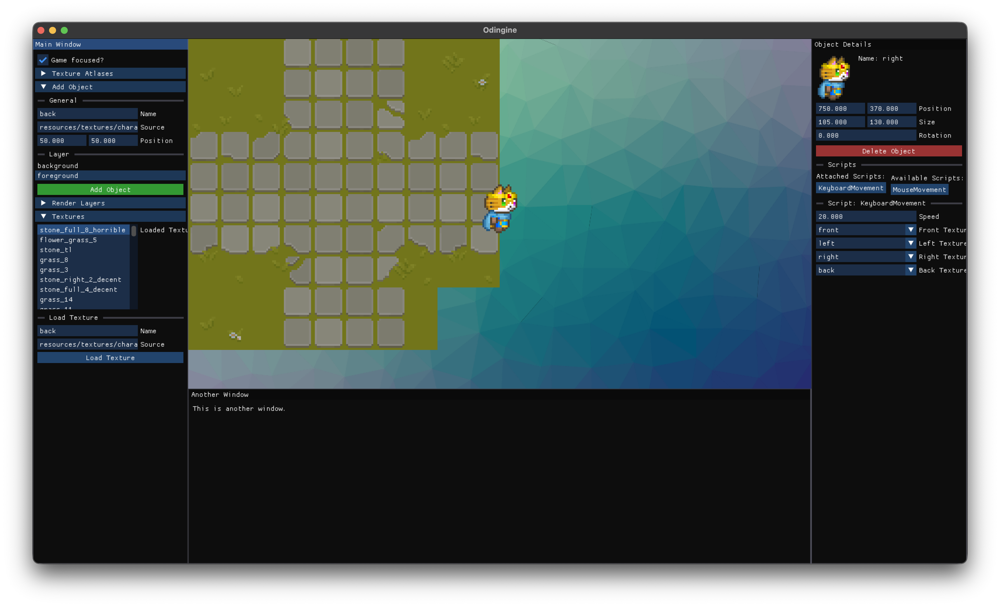

# Odingine


Odingine is a simple 2D game engine built using the Odin programming language. It aims to provide a straightforward and efficient way to create 2D games with minimal setup and boilerplate code.



## Running the Engine
1. Make sure you have [Odin](https://odin-lang.org/docs/install/) installed on your system.

2. Clone the repository:
   ```bash
   git clone https://github.com/tathyagarg/odingine
    cd odingine
    ```

3. Build and run the engine using Odin:
   ```bash
   odin run runtime
   ```

## Note
There is still a lot of major features to be added and bugs to be fixed. Other documentation can be found in the `docs` folder.
